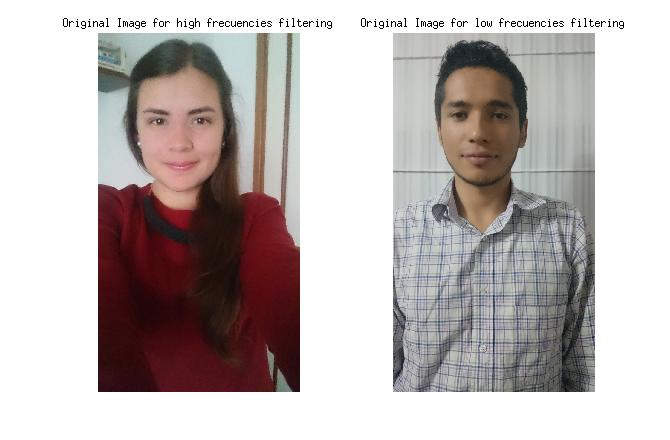
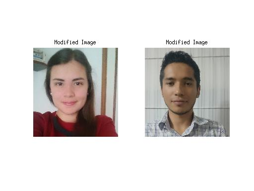
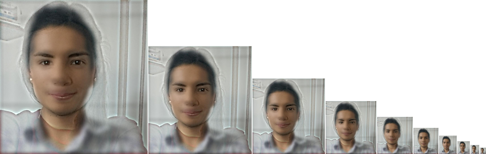

# Hybrid Image

## Original Images

These are the original images used to create de hybrid image. Both were taken using an smarthpone with resolution of 20 Mpixels. These are pictures from by boyfriend and me.

## Modified Images

There were some problems to align the original images so it was necessary to crop them with the purpose of create a better effect on the hybrid image. The visual effect was better just using our faces images.  

## Filtered Images

The high frecuencies were taken off from my picture and low frecuencies from by boyfriend picture.

## Final Result
This is the final result for the hybrid image. My face is visible when the image is big and my boyfriend face is visible when the pcture gets smaller, creating a the exected effect. This is caused because when the image is big, the high frecuencies of the original picture can be apreciated whereas the low frecuencies of the other no; but when the picture is small, is is more difficult to see the high frecuencies and easier to see the low ones. 

# Matlab Code

The Code used to create de Hybrid image is presented here:
%Images loading
A1=0.95.*(imrotate(im2double(imread('cat.JPG')),90));
B1=0.85*(imresize(imrotate(im2double(imread('dog.JPG')),-90),0.5));

%Images adjustment for better hybrid effect. Both images were cropped to
%generate an aligment between them.
A=A1(30:end-800,1:end-39,:);
B=B1(1:end-829,40:end,:);

%Cut frecuencies for images filtering at low frecuencies 
fc_A=12; 
fc_B=15;

%Low pass filters parameters generation. The filter used was a Gaussian filter, the
%relationship between kernel length, sigma and cut freequency was taken
%from the project of James Hays "Image filtering and hybrind images"
filter_A=fspecial('gaussian',fc_A*4+1,fc_A);
filter_B=fspecial('gaussian',fc_B*4+1,fc_B);

%Low pass filtering applied to botth images
B_low=imfilter(B,filter_B);
A_low=imfilter(A,filter_A);

%High pass filtering to image A. I is created from the substraction between
%the original image and the result from low pass filtering
A_high=imsubtract(A,A_low);

%Htbrid image creation. It is generated from the sum of low frequency
%filtered image (B) and high frequency filtered image (A)
Hybrid=imadd(B_low,A_high);

%Hybrid image visualization by progressively downsampling it. This was made
%using the vis_hybrid_image function developed by James Hays

%visualize a hybrid image by progressively downsampling the image and
%concatenating all of the images together.

scales = 10; %how many downsampled versions to create
scale_factor = 0.7; %how much to downsample each time
padding = 5; %how many pixels to pad.

original_height = size(Hybrid,1);
num_colors = size(Hybrid,3); %counting how many color channels the input has
output = Hybrid;
cur_image = Hybrid;

for i = 2:scales
    %add padding
    output = cat(2, output, ones(original_height, padding, num_colors));
    
    %dowsample image;
    cur_image = imresize(cur_image, scale_factor, 'bilinear');
    %pad the top and append to the output
    tmp = cat(1,ones(original_height - size(cur_image,1), size(cur_image,2), num_colors), cur_image);
    output = cat(2, output, tmp);    
end

imwrite(output,'Hybrid.jpg');

figure
imshow(output)

figure;
subplot(1,2,1)
imshow(A1)
title('Original Image for high frecuencies filtering');
subplot(1,2,2)
imshow(B1)
title('Original Image for low frecuencies filtering');

figure;
subplot(1,2,1)
imshow(A)
title('Modified Image');
subplot(1,2,2)
imshow(B)
title('Modified Image');

figure;
subplot(1,2,1)
imshow(A_high)
title('High Frecuencies filtered image');
subplot(1,2,2)
imshow(B_low)
title('Low Frecuencies filtered image');

